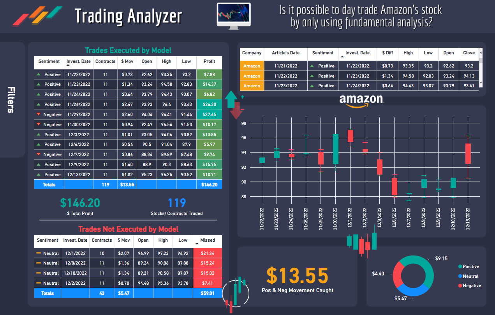
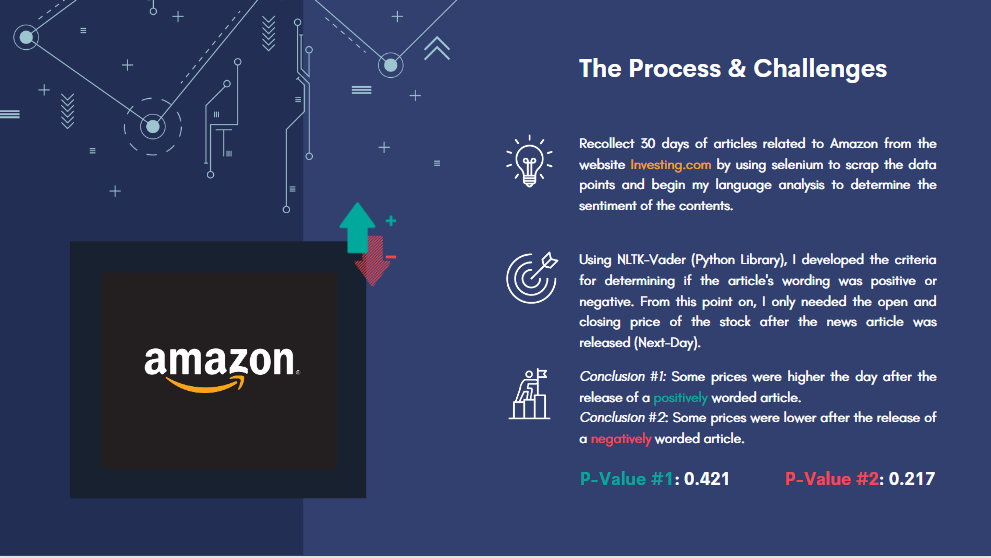

## Trading Analyzer - Selenium, NLP-Vader & Powered Amazon Stock Sentiment Analyzer.

  

&nbsp;

## Does the sentiment of news articles influence Amazon's stock price the next day?.

To test my hypothesis, I needed a sample to work with and determine my P—value. So I decided to use A/B testing with a significance level of 5%.
My objective was to compare the price before and after the article was released and if this followed the sentiment of the article's contents.

  

## Step by Step:

- Webscrapping: Using selenium to recollect 30 days of articles related to Amazon from the website Investing.com 
- NLP-Vader: Developing the criteria for determining if the article's wording was positive or negative. 
- Power BI Deployment: Showcase if I would be able to make any profit by only using fundamental analysis based on the news articles.

### More About Me...
Find me on [LinkedIn](https://www.linkedin.com/in/danieljmendezb/)
# trading_analyzer_pbi_nlp_project
